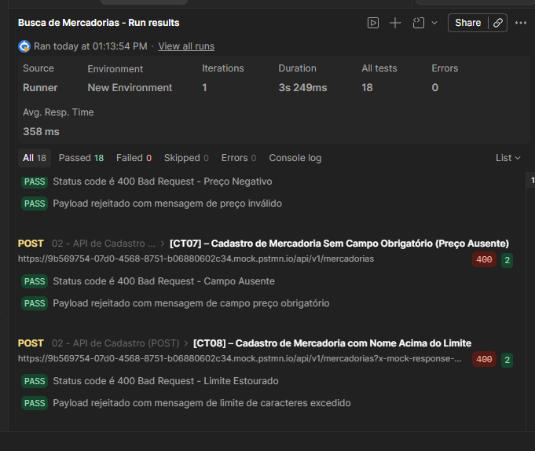

# 🐱 PetShop CatShop - API Automated Testing Suite

Repositório dedicado à automação de testes de API ponta a ponta para os fluxos de **Busca (GET)** e **Cadastro (POST)** de mercadorias. O projeto simula um ambiente de produção real utilizando um Mock Server estruturado, garantindo a validação de contratos, resiliência de dados e tratamento de exceções.

---

## 🛠️ Tecnologias e Ferramentas Utilizadas

* **Postman:** Criação do ambiente de Mock Server, requisições e execução em lote (Runner).
* **JavaScript (Postman Sandbox):** Desenvolvimento dos scripts de asserção, validação de esquemas e loops dinâmicos (`forEach`).
* **Jira & Zephyr Scale:** Planejamento estratégico, mapeamento de cenários (`CATQA-R1`) e gestão de evidências.
* **Git & GitHub:** Versionamento e portfólio.

---

## 📊 Matriz de Cenários Automatizados

Toda a suíte foi mapeada no Zephyr Scale e automatizada no Postman seguindo as seguintes especificações técnicas:

| ID (Zephyr) | Método | Cenário de Teste | Status HTTP | Tipo de Validação / Asserção |
| :--- | :---: | :--- | :---: | :--- |
| **CATQA-T1** | `GET` | Busca Combinada por Tipo e Marca com Sucesso | `200 OK` | Validação de Contrato e Integridade do Payload |
| **CATQA-T2** | `GET` | Resiliência no Tratamento de Caixa (Case-Insensitive) | `200 OK` | Ignorar maiúsculas/minúsculas nos filtros |
| **CATQA-T3** | `GET` | Estouro do Limite de Paginação Permitido | `422 Unprocessable` | Regra de negócio (Limite máximo > 100) |
| **CATQA-T4** | `GET` | Filtros de Busca Inexistentes | `200 OK` | Retorno íntegro de Array Vazio (`[]`) |
| **CATQA-T5** | `GET` | Opcionalidade de Parâmetros na URL | `200 OK` | Loop dinâmico varrendo o array por tipo |
| **CATQA-T6** | `POST` | Cadastro de Mercadoria com Preço Inválido | `400 Bad Request` | Bloqueio de valor monetário negativo |
| **CATQA-T7** | `POST` | Cadastro Sem Campo Obrigatório | `400 Bad Request` | Validação de esquema (Preço ausente) |
| **CATQA-T8** | `POST` | Cadastro com Nome Acima do Limite | `400 Bad Request` | Proteção contra estouro de campo (> 255 carac.) |

---

## 🚀 Resultados da Execução (Postman Runner)

A suíte regressiva foi executada com **100% de aproveitamento** (18 asserções bem-sucedidas em lote).

---

## 📁 Estrutura do Repositório

* `docs/zephyr/`: Planejamento técnico dos testes.
* `docs/evidencias/`: Evidências em print de tela cheia de cada caso de teste individual.
* `postman/`: Arquivo JSON da Collection pronto para importação.
* `mocks/`: Payloads JSON utilizados para alimentar o Mock Server.

---

## 📥 Como Executar este Projeto

1. Faça o clone deste repositório.
2. Abra o seu Postman.
3. Clique em **Import** e selecione o arquivo localizado em `postman/Busca de Mercadorias.postman_collection.json`.
4. Configure um Mock Server no seu Postman ou aponte para o seu ambiente local.
5. Clique com o botão direito na Collection > **Run collection** para executar a suíte em lote.